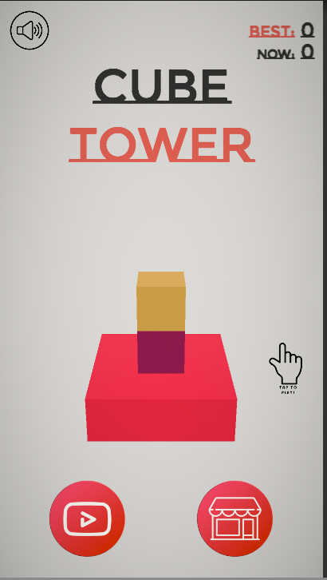
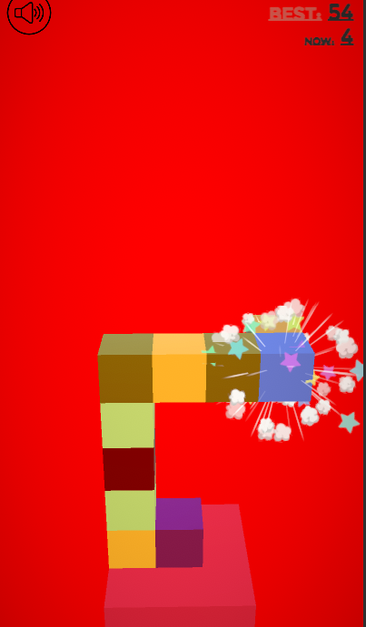

## Название игры: 🎮 Cube Tower 🏰

### Описание:

Cube Tower - захватывающая инди-игра для устройств Android, где ваша цель - строить башню из кубиков вверх.

### Особенности:

- 🌟 Простой и захватывающий геймплей: Простые механики игры, которые при этом могут создавать множество уникальных и креативных башен.

- 🏰 Строительство башни: Используйте свою ловкость и строительные навыки, чтобы создавать самые высокие и красивые башни из кубиков.

- 🚧 Преодоление препятствий: Преодолевайте различные препятствия и вызовы, которые могут встретиться на вашем пути к вершине.

### Скриншоты:

### Требования к системе:

- Минимальная версия Android: Android 5.0 (Lollipop) или выше.
- Рекомендуемое разрешение экрана: 720x1280 пикселей или выше.

### Контакты:

Если у вас возникли вопросы или предложения, свяжитесь с JusteRYT по адресу tohappyoneguy@yandex.ru.

### Авторы:

Разработано JusteRYT.
